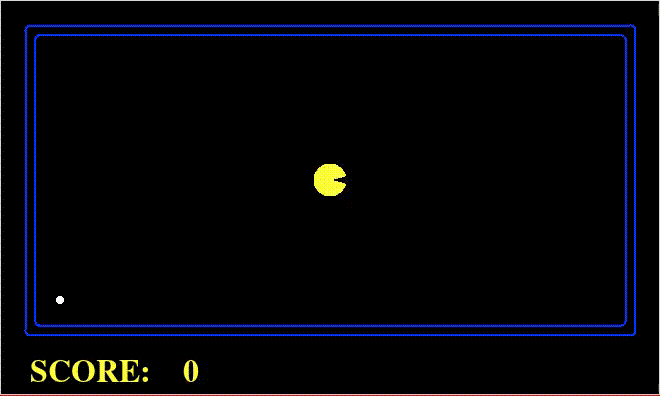
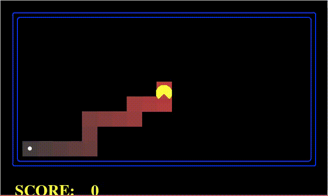
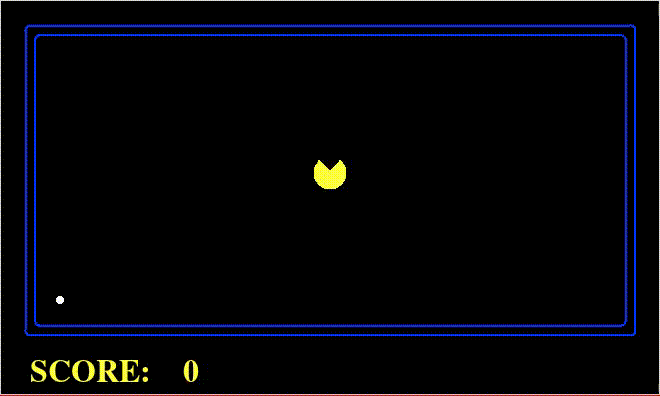
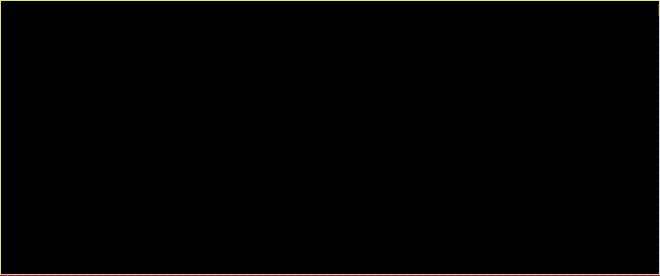

# Busca de Caminhos - PAC-MAN - Relatório de Resultados,

Grupo:
-	Guilherme Souza,
-	Jonathas Conceição,
-	Mateus Schmalfuss.

## Algoritmos

Quatro algoritmos foram implementados para busca de caminho no jogo do PAC-MAN:
- [A*](#a-estrela)
- [Custo Uniforme](#custo-uniforme)
- [Têmpera Simulada](#têmpera-simulada)
- [Subida de Encosta](#subida-de-encosta)

Os Gifs neste relatório apresentam mostram
(1) o PAC-MAN,
(2) o estado final (representado pela comida),
(3) o labirtion que ele deve resolver,
(4) e os estados explorados.
Estados explorados são marcados em vermelho,
sendo os primeiros a serem explorados de um tom mais forte,
e os últimos um tom mais leve.
Nos Gifs o PAC-MAN percorre o caminho que encontrei para atingir o estado final.

Ao fim são apresentados [resultados e comparação](#resultados-e-comparação) entre os algoritmos.

### A Estrela
O **A\*** é um algoritmo de _busca informada_ que pode ser aplicado em grafos ponderados.
Partindo de um nodo inicial do grafo,
tem-se como objetivo encontrar o caminho de menor custo até um nodo objetivo.
Ele executa mantendo uma árvore de caminhos originados do nodo inicial
e passando pelas arestas até que o nodo final seja atingido.

  
**Gif 1: Exemplo da busca A\***

O Gif 1 mostra uma busca em A* executada usando
uma heurística de _Distância Manhattan_,
como há um caminho direto,
o PAC-MAN encontra o estado final sem precisar explorar estados adicionais.

### Custo Uniforme
A busca em **Custo Uniforme**,
também chamada de _algoritmo de Dijkstra_,
é usado para encontrar a menor distância entre dois nodos em um grafo ponderado.
No jogo do PAC-MAN pode-se aplicar peso às arestas
e usar a busca em **Custo Uniforme** para fazer o PAC-MAN priorizar caminho em uma direção.

  
**Gif 2: Exemplo da busca em Custo Uniforme**

O Gif 2 mostra uma busca de Custo Uniforme executada usando
pesos que priorizam a ida para esquerda.
Um caminho direto para esquerda é o primeiro a ser considerado,
ao atingir uma parede,
alternativas com mais uma curva para cima ou para baixo passa a ser consideradas,
o PAC-MAN eventualmente encontra o estado final e executa o percurso.

### Têmpera Simulada
_Intro Text_

  
**Gif 3: Exemplo da busca usando Tempera Simulada**

_Text about Gif_

### Subida de Encosta
_Intro Text_

  
**Gif 4: Exemplo da busca em Custo Uniforme**

_Text about Gif_

## Resultados e Comparação
Para comparação dos algoritmos a execução em dois labirintos diferentes foi considerada.
As tabelas apresentam o desempenho dos quatro algoritmos para os labirintos em questão.

No Labirinto 1 o **A\*** foi usado com a heurística de _Distância Manhattan_,
a **Custo Uniforme** com pesos que favorecem a ida para _esquerda_.
Pode-se observar que,
como há uma parede separando o caminho reto do PAC-MAN à comida,
o algoritmo **A\*** usando a _Distância Manhattan_ resulta numa resposta sub-ótima;
enquanto os pesos usados no **Custo Uniforme** o permitem encontrar a melhor resposta,
além de gastar menos esforço computacional.

  
**Figura 1: Labirinto 1**

**Tabela 1: Comparação no Labirinto 1**  
|     Algoritmo     | Qnt. Estados | Pontuação |  
|:-----------------:|:------------:|:---------:|  
|         A*        |      76      |    470    |  
|   Custo Uniforme  |      64      |    474    |  
|  Têmpera Simulada |              |           |  
| Subida de Encosta |       5      |     -     |  

Já no Labirinto 2, o **A\*** foi usado com a heurística de (...),
a _Custo Uniforme_ com pesos (...).
Pode-se observar que o (...)

  
**Figura 2: Labirinto 2**

**Tabela 2: Comparação no Labirinto 2**  
|     Algoritmo     | Qnt. Estados | Pontuação |  
|:-----------------:|:------------:|:---------:|  
|         A*        |       0      |     0     |  
|   Custo Uniforme  |       0      |     0     |  
|  Têmpera Simulada |       0      |     0     |  
| Subida de Encosta |       0      |     0     |  

