# Busca de Caminhos - PAC-MAN - Relatório de Resultados

Grupo:
-	Guilherme Souza,
-	Jonathas Conceição,
-	Mateus Schmalfuss.

## Algoritmos

Quatro algoritmos foram implementados para busca de caminho no jogo do PAC-MAN:
- [A*](#a-estrela)
- [Custo Uniforme](#custo-uniforme)
- [Têmpera Simulada](#têmpera-simulada)
- [Subida de Encosta](#subida-de-encosta)

Os Gifs neste relatório apresentam mostram
(1) o PAC-MAN,
(2) o estado final (representado pela comida),
(3) o labirinto que ele deve resolver,
(4) e os estados explorados.
Estados explorados são marcados em vermelho,
sendo os primeiros a serem explorados de um tom mais forte,
e os últimos um tom mais leve.
Nos Gifs o PAC-MAN percorre o caminho que encontrei para atingir o estado final.

Ao fim são apresentados [resultados e comparação](#resultados-e-comparação) entre os algoritmos
e [labirintos extras](#labirintos-extras) implementados para testes.

### A Estrela
O **A\*** é um algoritmo de _busca informada_ que pode ser aplicado em grafos ponderados.
Partindo de um nodo inicial do grafo,
tem-se como objetivo encontrar o caminho de menor custo até um nodo objetivo.
Ele executa mantendo uma árvore de caminhos originados do nodo inicial
e passando pelas arestas até que o nodo final seja atingido.

  
**Gif 1: Exemplo da busca A\***

O Gif 1 mostra uma busca em A* executada usando
uma heurística de _Distância Manhattan_,
como há um caminho direto,
o PAC-MAN encontra o estado final sem precisar explorar estados adicionais.

### Custo Uniforme
A busca em **Custo Uniforme**,
também chamada de _algoritmo de Dijkstra_,
é usado para encontrar a menor distância entre dois nodos em um grafo ponderado.
No jogo do PAC-MAN pode-se aplicar peso às arestas
e usar a busca em **Custo Uniforme** para fazer o PAC-MAN priorizar caminho em uma direção.

  
**Gif 2: Exemplo da busca em Custo Uniforme**

O Gif 2 mostra uma busca de Custo Uniforme executada usando
pesos que priorizam a ida para esquerda.
Um caminho direto para esquerda é o primeiro a ser considerado,
ao atingir uma parede,
alternativas com mais uma curva para cima ou para baixo passa a ser consideradas,
o PAC-MAN eventualmente encontra o estado final e executa o percurso.

### Têmpera Simulada
O **Têmpera Simulada** é uma técnica de busca com melhora iterativa probabilística, similar
à subida de encosta.
Ele parte de um estado inicial com uma "temperatura" inicial alta e substitui a solução
atual por uma solução vizinha no espaço de estados com uma probabilidade de aceitar
soluções não ótimas baseadas na temperatura, que diminui a cada iteração.
Dessa forma aos poucos ele tende a aceitar cada vez menos soluções piores do que a atual
e converge a um estado global ótimo.

  
**Gif 3: Exemplo da busca usando Tempera Simulada**

_Text about Gif_

### Subida de Encosta
A **Subida de Encosta** é um algoritmo de busca com melhoria iterativa.
A ideia é começar com um estado inicial e melhora-lo iterativamente,
a altura de qualquer ponto da superfície corresponde a função de avaliação do estado
naquele ponto. O algoritmo se "move" pela superfície buscando pontos mais altos/baixos
o **Subida de Encosta** se move em valor crescente (encosta a cima), terminando quando
alcançar seu pico máximo ou seja nem um vizinho será mais alto que o ponto atual (nem um
vizinho tem valor mais alto), não havendo necessidade de armazenar a arvore inteira,
guardando somente o estado atual, para que possa tentar melhora-lo e seguir a procura
pelo de maior pico. 

  
**Gif 4: Exemplo da busca em Custo Uniforme**

O Gif 4 demonstra a busca com melhoria iterativa utilizando o algoritmo **subida de encosta**.
Procura a superfície de maior altura (maior valor), seguindo em direção na ordem das mesmas. Por
buscar sempre o pico mais alto muitas vezes dependendo das suas escolhas pode por acabar preso em
uma superfície a qual não contem um descendente maior, dessa forma finalizando a busca na maior
superfície encontrada pelo algoritmo.  

## Resultados e Comparação
Para comparação dos algoritmos a execução em dois labirintos diferentes foi considerada.
As tabelas apresentam o desempenho dos quatro algoritmos para os labirintos em questão.
Como o **Têmpera Simulada** tem uma fator probabilístico,
a tabela apresa resultados da média de 30 execuções.

No Labirinto 1 o **A\*** foi usado com a heurística de _Distância Manhattan_,
a **Custo Uniforme** com pesos que favorecem a ida para _esquerda_.
Pode-se observar que,
(1) como há uma parede separando o caminho reto do PAC-MAN à comida,
o algoritmo **A\*** usando a _Distância Manhattan_ resulta numa resposta sub-ótima;
(2) Com os pesos usados no **Custo Uniforme**, é possível encontrar a melhor resposta,
além de gastar menos esforço computacional;
(3) a **Têmpera Simulada** usando heurística de pesos iguais,
por conta da aleatoriedade do algoritmo gera resultados inferiores,
mas sempre encontra a resposta final;
(4) a **Subida de Encosta**, por sua vez, usando uma heurística de _Distância Manhattan_,
falha ao encontrar a resposta final, não gerando uma pontuação final.

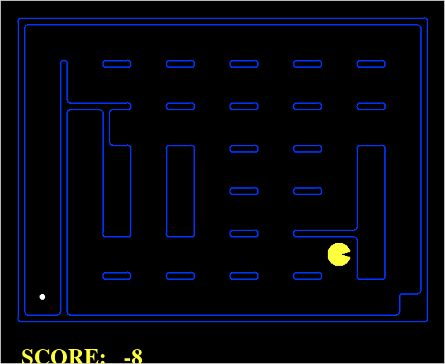  
**Figura 1: Labirinto 1**

**Tabela 1: Comparação no Labirinto 1**

|     Algoritmo     | Qnt. Estados | Pontuação |
|:-----------------:|:------------:|:---------:|
|         A*        |      76      |    470    |
|   Custo Uniforme  |      64      |    474    |
|  Têmpera Simulada |    98.26     |  453.86   |
| Subida de Encosta |      23      |     -     |

Já no Labirinto 2, o **A\*** foi usado com a heurística de _Distância Euclidiana_,
e o _Custo Uniforme_ com pesos que favorecem a ida para _esquerda_.
Pode-se observar que,
(1) o **A\*** termina explorando todos os estados possíveis, mas encontra a resposta ótima;
(2) a busca em **Custo Uniforme** também explora todos os estados e encontra a resposta ótima;
(3) a **Têmpera Simulada** usando heurística com pesos iguais encontrou resposta ótima;
(4) a **Subida de Encosta**, por fim, encontrou a resposta final sem se perder em caminhos secundários,
encontrado a resposta ótima com menos esforço computacional.

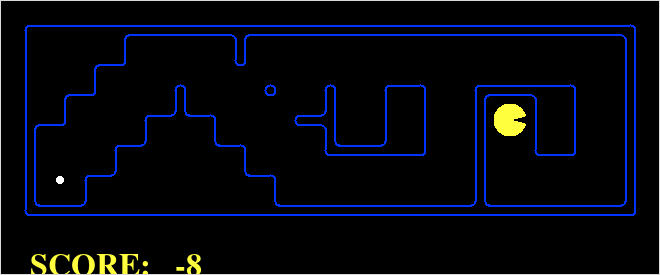  
**Figura 2: Labirinto 2**

**Tabela 2: Comparação no Labirinto 2**

|     Algoritmo     | Qnt. Estados | Pontuação |
|:-----------------:|:------------:|:---------:|
|         A*        |      48      |    471    |
|   Custo Uniforme  |      48      |    471    |
|  Têmpera Simulada |      48      |    471    |
| Subida de Encosta |      39      |    471    |

Assim como pode ser observado pelos experimentos relatados aqui,
a escolha do algoritmo (e da heurística) devem levar em consideração o problema ser tratado,
para que assim se possa encontrar a resposta ótima com menor esforço computacional.

## Labirintos Extras
Para este trabalho foi desenvolvido mais mapas além dos _default_ para testes situacionais dos
algoritmos. Seguindo os mesmos padrões já existentes, mapas _Small_, _Mediun_ e _Big_, em alguns
dos mapas foi proporcionado mais caminhos para vitoria, porém alguns com uma distancia um pouco menor
ou seja uma solução a primeira vista melhor, para poder se analisar como os algoritmos explorariam
o mapa e qual seria a decisão tomada pelo mesmo.
Outros proporcionam um mapa um tanto quanto bagunçado com uma ou no máximo duas possibilidades de
vitoria, porém com percursos maiores e mais "complicados" para se chegar a uma escolha (uma escolha a
qual não se baseia somente na vitória e sim qual caminho aparentemente seria o melhor a seguir).
Tais mapas nos proporcionaram uma melhor comparação entre os algoritmos aqui aplicados, pois cada
algoritmo demonstra um comportamento diferente em mapas iguais (o que é correto), com a construção de
novos labirintos tornou-se possível um o qual o caminhos tomado por todo é o mesmo, porem cada um explorando
e seguindo sua ideia de busca.

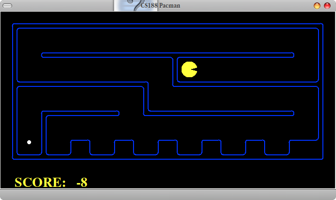

**Figura 3: Labirinto pequeno 1.**

**Figura 4: Labirinto pequeno 2.**

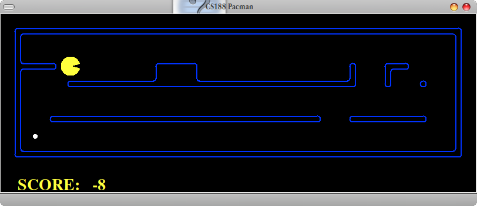

**Figura 5: Labirinto pequeno 3.**

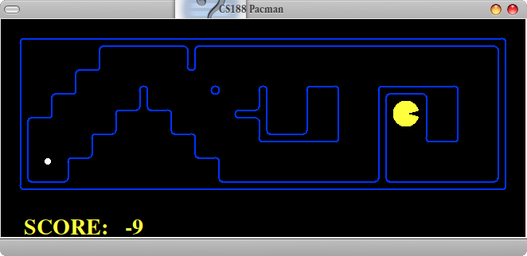

**Figura 6: Labirinto pequeno 4.**

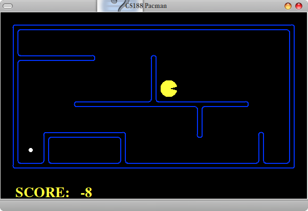

**Figura 7: Labirinto pequeno 5.**

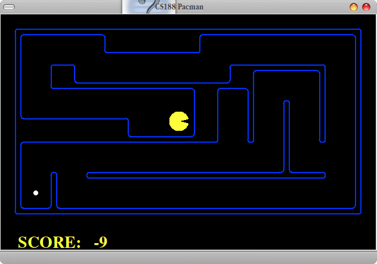

**Figura 8: Labirinto médio 1.**

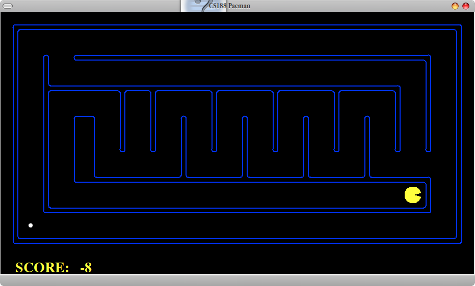

**Figura 9: Labirinto médio 2.**

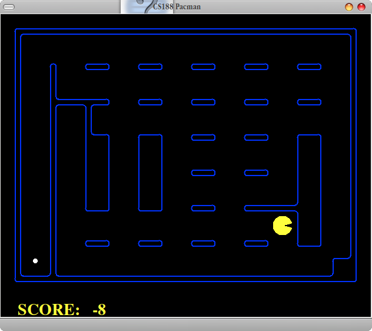

**Figura 10: Labirinto médio 3.**

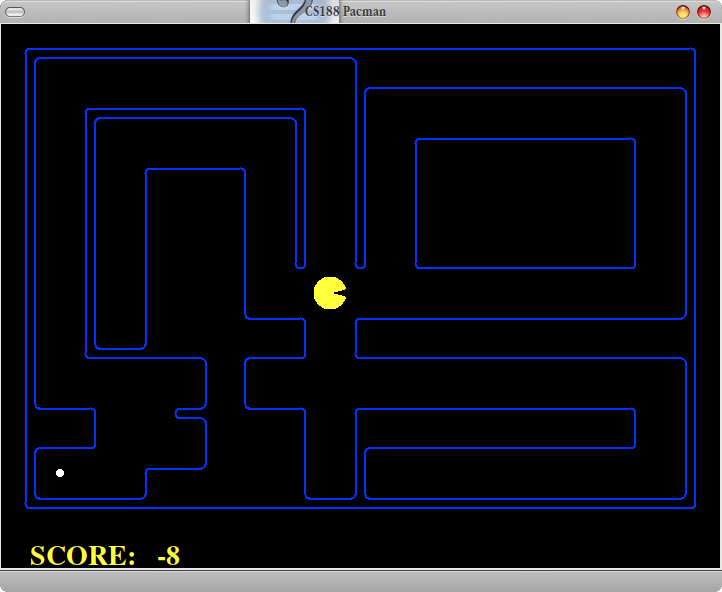

**Figura 11: Labirinto médio 4.**

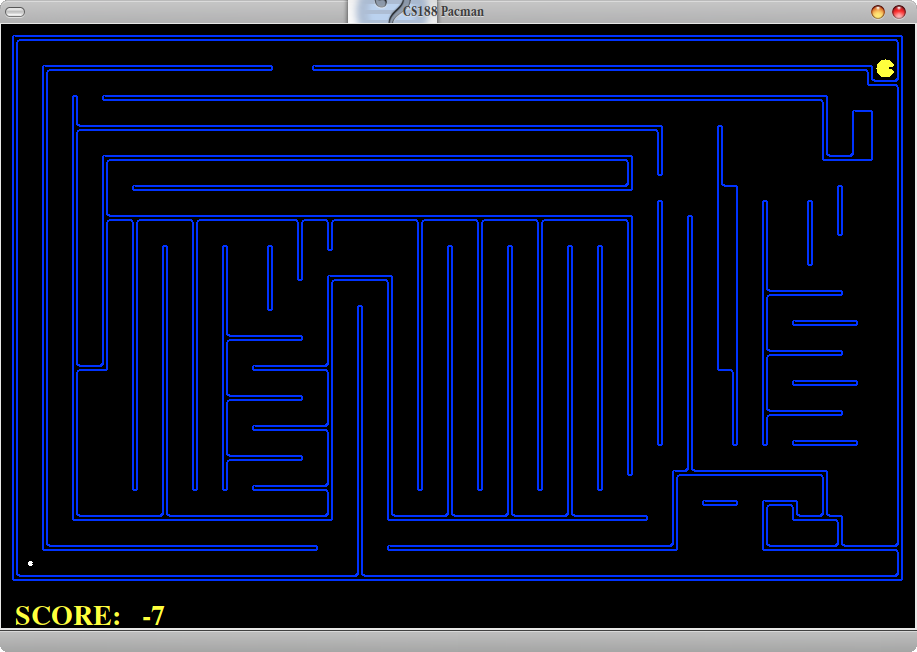

**Figura 12: Labirinto grande 1.**

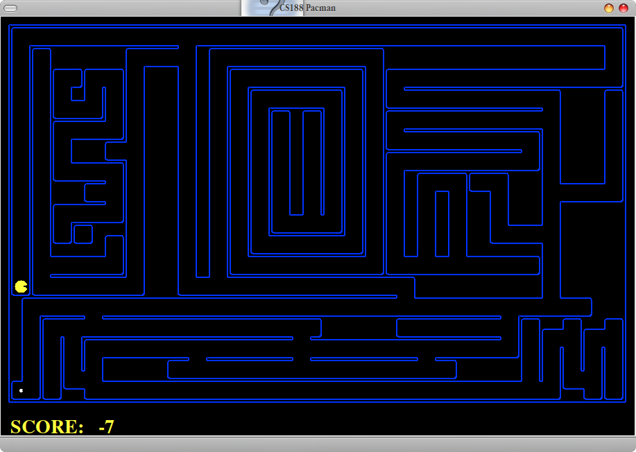

**Figura 13: Labirinto grande 2.**

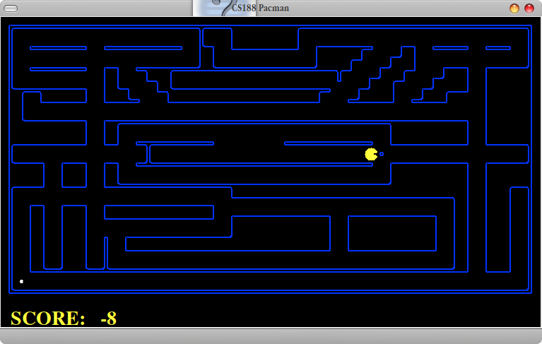

**Figura 14: Labirinto grande 3.**

**Figura 15: Labirinto grande 4.**

  
**Figura n+2: Labirinto n+2**

