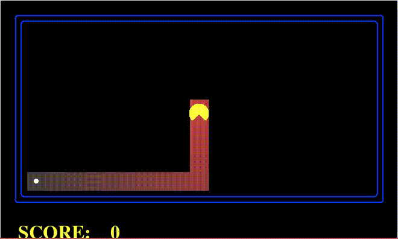

# Busca de Caminhos - PAC-MAN - Relatório de Resultados,

Grupo:
-	Guilherme Souza,
-	Jonathas Conceição,
-	Mateus Schmalfuss.

## Algoritmos

Quatro algoritmos foram implementados para busca de caminho no jogo do PAC-MAN:
- [A*](#a-estrela)
- [Custo Uniforme](#custo-uniforme)
- [Têmpera Simulada](#têmpera-simulada)
- [Subida de Encosta](#subida-de-encosta)

Ao fim são apresentados [resultados e comparação](#resultados-e-comparação) entre os algoritmos.

### A Estrela
O **A\*** é um algoritmo de _busca informada_ que pode ser aplicado em grafos ponderados.
Partindo de um nodo inicial do grafo,
tem-se como objetivo encontrar o caminho de menor custo até um nodo objetivo.
Ele executa mantendo uma árvore de caminhos originados do nodo inicial
e passando pelas arestas até que o nodo final seja atingido.

_Text about Gif_

### Custo Uniforme
A busca em **Custo Uniforme**,
também chamada de _algoritmo de Dijkstra_,
é usado para encontrar a menor distância entre dois nodos em um grafo ponderado.
No jogo do PAC-MAN pode-se aplicar peso às arestas
e usar a busca em **Custo Uniforme** para fazer o PAC-MAN priorizar caminho em uma direção.

_Text about Gif_

### Têmpera Simulada
_Intro Text_

### Subida de Encosta
_Intro Text_

_Text about Gif_

## Resultados e Comparação
